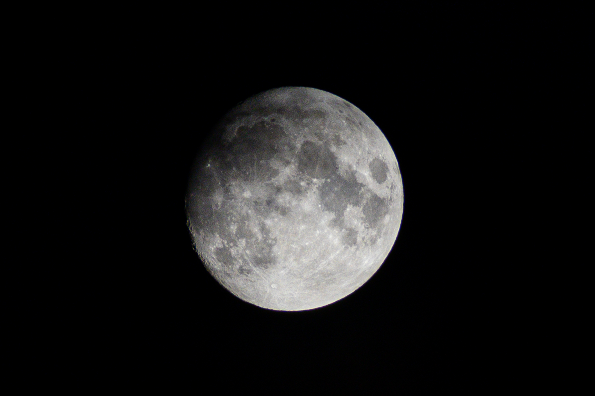

To add an image, add an exclamation mark (!), followed by alt text in brackets, and the path or URL to the image asset in parentheses.
You can optionally add a title in quotation marks after the path or URL.

```

```


## Figure shortcode

Next to the markdown image, you can use the `` shortcode.

### Examples

#### Center (default)

```

```



#### Wide

```

```



#### Left

```

```



Lorem ipsum dolor sit amet, consectetur adipiscing elit, sed do eiusmod tempor incididunt ut labore et dolore magna aliqua. Elementum facilisis leo vel fringilla est ullamcorper eget. Et sollicitudin ac orci phasellus egestas. Arcu cursus euismod quis viverra nibh. Consectetur purus ut faucibus pulvinar elementum integer. Pulvinar neque laoreet suspendisse interdum consectetur. At quis risus sed vulputate odio ut enim. Sed id semper risus in. Et leo duis ut diam quam nulla. Sem et tortor consequat id porta. Faucibus nisl tincidunt eget nullam non nisi. Turpis egestas pretium aenean pharetra magna ac placerat vestibulum lectus. Ultricies mi eget mauris pharetra et ultrices neque ornare aenean. Nibh tellus molestie nunc non blandit massa enim nec. Lectus urna duis convallis convallis tellus id interdum velit.

#### Right

```

```



Lorem ipsum dolor sit amet, consectetur adipiscing elit, sed do eiusmod tempor incididunt ut labore et dolore magna aliqua. Cum sociis natoque penatibus et magnis dis. Vitae aliquet nec ullamcorper sit amet risus nullam eget felis. Interdum posuere lorem ipsum dolor. Orci porta non pulvinar neque laoreet suspendisse. Congue quisque egestas diam in arcu cursus euismod quis viverra. Elementum integer enim neque volutpat ac tincidunt vitae semper quis. At varius vel pharetra vel turpis nunc eget. Dui sapien eget mi proin sed libero enim. Felis donec et odio pellentesque diam. Bibendum arcu vitae elementum curabitur vitae nunc. Purus sit amet luctus venenatis lectus magna fringilla urna porttitor. Vulputate eu scelerisque felis imperdiet proin fermentum leo vel orci. Vitae semper quis lectus nulla at volutpat diam ut. Quis ipsum suspendisse ultrices gravida dictum fusce ut placerat.

### Attributes

src
: required - URL of the image to be displayed.

link
: optional - If the image needs to be hyperlinked, URL of the destination.

target
: optional - Optional `target` attribute for the URL if `link` parameter is set.

rel
: optional - Optional `rel` attribute for the URL if `link` parameter is set.

alt
: optional - Alternate text for the image if the image cannot be displayed. Recommended for SEO.

align
: optional - Defines how the image should be aligned, the options are `center` (default), `wide`, `left`, and `right`

title
: optional - Image title. Shows when you hover the image.

caption
: optional - Image caption. Markdown within the value of `caption` will be rendered.

height
: optional - `height` attribute of the image.

width
: optional - `width` attribute of the image.

attr
: optional - Image attribution text. Markdown within the value of `attr` will be rendered.

attrlink
: optional - If the attribution text needs to be hyperlinked, URL of the destination.
